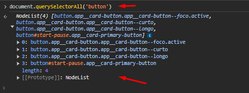

# Acessando elementos


Quando trabalhamos com frontend, é comum  acessar elementos especificos para criar uma interação ou algo do tipo. E para que possamos acessar apenas um elemento, podemos utilizar o QuerySelector, mas antes devemos dar um document., pois ele está referenciando o arquivo que queremos selecionar os elementos. A sintaxe é:

```javascript
document.querySelector('elemento');
```

#### <mark style="color:blue;">O que está acontecendo?</mark>

* document: ele referencia o documento, o projeto que estamos acessando.
* querySelector: ele é o método utilizado para indicar o elementos que estamos buscando, além dele temos o querySelectorAll, que buscará pot todos elementos com aquela nomenclatura.&#x20;
* elemento: é o que voce está buscando.

### E no console?

É comum acessarmos os elementos pelo console para entender o que está retornando, mas usaremos mesmo na nossa IDE. Então quando mandamos a linha de código ele já retorna o elemento que usamos como parâmetro, lembrando que quando se trata de classe devemos adicionar o <mark style="color:yellow;">.</mark> e quando se trata de um id, devemos utilizar o #.

<mark style="color:blue;">**O que mais?**</mark>

Deste modo podemos acessar apenas um elemento, mas e se quisermos acessar mais de um elemento? podemos utilizar o QuerySelectorAll. Não muda a sintaxe, mas o que diferencial é que ele retornará todos os elementos que possuem aquele tipo. Ex:

<div align="left">

<figure><figcaption></figcaption></figure>

</div>

Desse modo ele retorna um array com os resultados.&#x20;

### E na IDE?

O normal é atribuirmos o elemento a uma variavel, assim podemos criar interações com o elemento. Ex:

```javascript
const btnAddTarefa = document.querySelector('.app__button--add-task');
```

